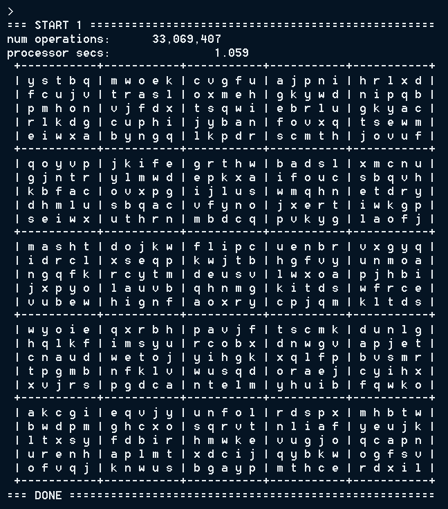

# Sudoku Solution Generation & Equivalence Checker with C++

While most existing programming work related to Sudoku tackles the problem of _solving_ puzzles, this one looks at _generating_ the solutions that are then turned into puzzles. The goal is to answer the question, "How can we generate a highly random Sudoku solution (a full and valid Sudoku grid) out of nothing, and do so within a short timeframe for largeish grid sizes (ie. not just 9x9)?" The statement is not incredibly precise, but that's because there isn't a lot of other work to benchmark against.

I have made a simple, web-based visualizer of the algorithm at work in a sister repo, [**Sudoku-JS**](https://david-fong.github.io/Sudoku-JS/), which I highly encourage you to take a look at.

This project also includes an equivalence checker.

For my hardware-implementation project, go to [**Sudoku-SV**](https://github.com/david-fong/Sudoku-SV).

## How to Run It

Note: If building for windows, make sure you have mingw-w64 installed, and set the [`WINDOWS_ANSI`](./src/buildflag.hpp) build flag to true. This project was originally developed using mingw-w64. Pull requests are appreciated to fix any issues encountered when building for other systems.

```shell
cd src
./build.sh
./main
```

Upon starting the program, you will enter the REPL and be greeted with information about defaulted arguments to the main function, and a menu of commands and their functions.

Below is a screenshot of what you might see after running `./main 5` and running a couple generation attempts. The solver is tuned to give up in a way that optimizes throughput when generating batches of solutions, so you may notice many attempts giving up for size 5 before getting one that works.



Below is a screenshot of what you might see after running `./main 4`, then `output nogiveups` to suppress output for given-up trials, then `strials 10000` to generate solutions until 10000 have completed successfully.


## The Code

This is not an explanation of the algorithm! If you would like that, you can see it for yourself using [the web-visualizer](https://david-fong.github.io/Sudoku-JS/).

|   | |
|:-:|-|
| Separation of Concerns | The solver-functioning is its own class, encapsulated as a field of the REPL, which is its own, separate class. The REPL also separates token matching (for sub-commands) from token consumption, so it can be cleanly interfaced with via both strings and token enums. |
| Space Efficiency | The solver class uses a grid-size template parameter to conditionally specify the byte-width of its members. You can find those type definitions in [src/logic/size.hpp](src/logic/size.hpp). This allows for less "wasted space" in the cache. The code is written in such a way where consumers can choose which grid-sizes they would like to expand the template for, since each one will have its own code. |
| Effort-Params | The solver gives up generation attempts when it has judged it to take "too long". These have been tuned to optimize machine-agnostic performance. The explanation printed when generating batches of solutions can be found in [src/repl/trials.cpp](src/repl/trials.cpp) |
| Multi-threading | There isn't much interesting stuff going on here, although I learned a lot about the C++ language to write the code in a way that I was satisfied with. For large grid sizes where it takes much longer to try to generate a solution, the REPL will spawn more threads, which each run the same algorithm, but just with different seeds to randomize their work. It makes use of more of the CPU's cores. That's all. you can find the related code in the ["trials" files](src/repl). |
| Compiler Optimizations | This program uses [GCC builtins](https://gcc.gnu.org/onlinedocs/gcc/Other-Builtins.html) such as `ctz`, `popcount`, `__builtin_expect`, and other language features like `[[gnu::const]]` and `[[gnu::hot]]`. I also took a dip into program profiling and related optimization possibilities, but not enough to get any noticeable benefit from it. |

## My Past and Future Related Works

Sudoku is a favourite puzzle game of mine. When I started programming in my first year of university, I wrote a solution generator in C. Looking back, I can say the code was terrible, but I still remember the feelings of excitement and gratification that I felt. I [reworked it after learning Java](https://github.com/david-fong/Sudoku-J), then later started this repo, and next, I look to design various [hardware implementations using SystemVerilog](https://github.com/david-fong/Sudoku-SV).
