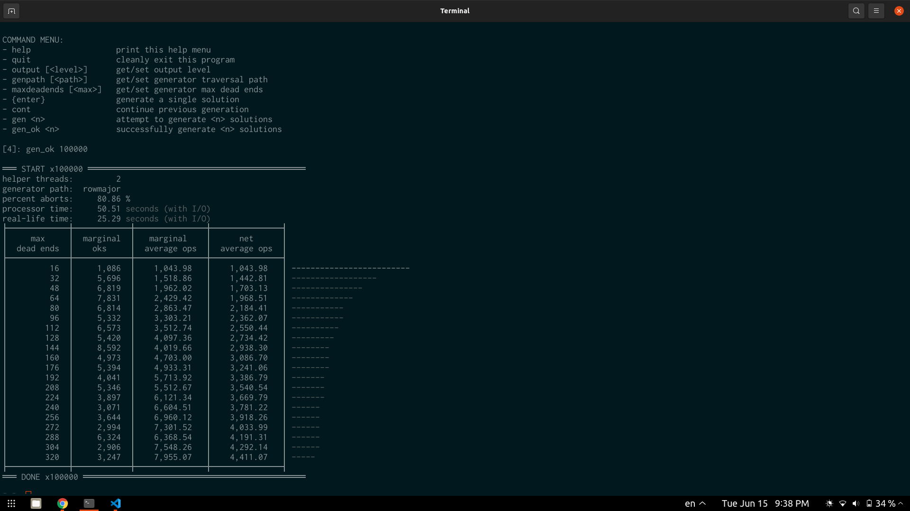

# C++ Solvent

## Using the Dynamic Library

Building solvent requires CMake (with [the minimum specified version](./CMakeLists.txt)), a C++ compiler [supporting C++20](https://en.cppreference.com/w/cpp/compiler_support), and a build system like Make or Ninja.

As for actually linking to the dynamic library, ¯\\\_(ツ)\_/¯. I don't really know how this stuff works. See [solvent\_cli's CMakeLists.txt](./src/solvent_cli/CMakeLists.txt) for inspiration. Maybe this will help: [https://tldp.org/HOWTO/Program-Library-HOWTO/shared-libraries.html](tldp.org on shared libraries)

- Make sure to read and follow the api contracts documented in the headers. Exceptions are intentionally not thrown for precondition violations.

- To change the supported grid sizes that get compiled, create a [tweak header](https://vector-of-bool.github.io/2020/10/04/lib-configuration.html#providing-a-tweak-header) for [`include/solvent_config.hpp`](include/solvent_config.hpp).

- It does not make any use of `printf` and friends, so it is safe to do `std::ios_base::sync_with_stdio(false);`.

## Building and Running solvent\_cli

```shell
# cd into the cpp directory first
cmake -S . -B build/release -DCMAKE_BUILD_TYPE=Release
cd build/release
cmake --build . --config=Release
./src/solvent_cli/solvent_cli
```

Below is a screenshot of what you might see after running `./solvent_cli 5` and running a couple generation attempts. The solver is tuned to give up in a way that optimizes throughput when generating batches of solutions, so you will notice _many_ attempts giving up for size 5 before getting one that works.


Below is a screenshot of what you might see after running `./solvent_cli 4`, then `gen_ok 100000` to generate solutions until 100000 have completed successfully.



## Issue Procedure

If you encounter an issue or seemingly problematic behaviour,

1. If it's an obvious problem due to something like a beginner's mistake in using CMake, please 

TODO